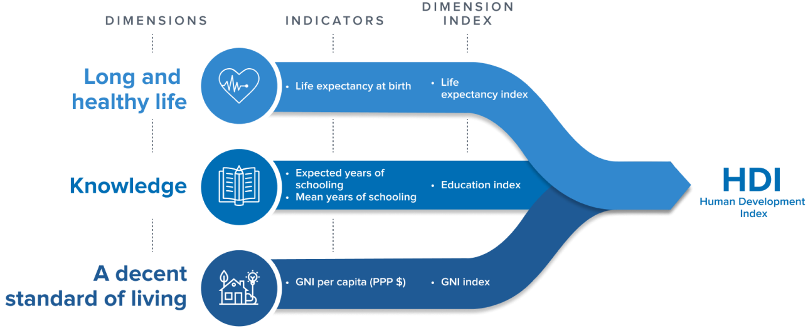

---
jupyter:
  jupytext:
    formats: ipynb,Rmd
    notebook_metadata_filter: all,-language_info
    split_at_heading: true
    text_representation:
      extension: .Rmd
      format_name: rmarkdown
      format_version: '1.2'
      jupytext_version: 1.17.1
  kernelspec:
    display_name: Python 3 (ipykernel)
    language: python
    name: python3
---
<!-- #region -->
# Pandas from Numpy


By Matthew Brett and Peter Rush

This tutorial will show the fundamental structure of Pandas Data Frames. We will look at the components that constitute a Data Frame - for instance, numpy arrays - in order to gain a deeper understanding of the raw ingredients that more advanced Pandas methods and functions operate on.

## What is Pandas?

Pandas is an open-source python library for data manipulation and analysis. 

```{note}
Why is Pandas called Pandas?

The “Pandas” name is short for “panel data”. The library was named after the
type of econometrics panel data that it was designed to analyse. [Panel
data](https://en.wikipedia.org/wiki/Panel_data) are longitudinal data where
the same observational units (e.g. countries) are observed over multiple
instances across time.
```

The Pandas Data Frame is the most important feature of the Pandas library. Data Frames, as the name suggests, contain not only the data for an analysis, but a toolkit of methods for cleaning, plotting and interacting with the data in flexible ways. For more information about Pandas see [this page](https://Pandas.pydata.org/about/).

The standard way to make a new Data Frame is to ask Pandas to read a data file
(like a `.csv` file) into a Data Frame. Before we do that however, we will
build our own Data Frame from scratch, beginning with the fundamental building
block for Data Frames: Numpy arrays.
<!-- #endregion -->

```{python}
# import the libraries needed for this page
import numpy as np
import pandas as pd
```

## Numpy arrays

Let's say we have some data that applies to a set of countries, and we have some countries in mind:

```{python}
pountry_names_array = np.array(['Australia', 'Brazil', 'Canada',
                                'China', 'Germany', 'Spain',
                                'France', 'United Kingdom', 'India',
                                'Italy', 'Japan', 'South Korea',
                                'Mexico', 'Russia', 'United States'])
country_names_array
```

For compactness, we'll also want to use the corresponding [standard
three-letter code](https://en.wikipedia.org/wiki/ISO_3166-1_alpha-3) for each
country, like so:

```{python}
country_codes_array = np.array(['AUS', 'BRA', 'CAN',
                                'CHN', 'DEU', 'ESP',
                                'FRA', 'GBR', 'IND',
                                'ITA', 'JPN', 'KOR',
                                'MEX', 'RUS', 'USA'])
country_codes_array
```

For each of these countries, we have a Human Development Index (HDI) score. The
HDI score for a country is a summary over multiple dimensions of human
development: life expectancy, average years of schooling and Gross National
Income per capita. 



([Image credit](https://hdr.undp.org/data-center/human-development-index#/indices/HDI)))

```{python}
# Human Development Index Scores for each country
hdis_array = np.array([0.896, 0.668, 0.89 , 0.586,
                       0.844, 0.89 , 0.49 , 0.842,
                       0.883, 0.709, 0.733, 0.824,
                       0.828, 0.863, 0.894])

hdis_array
```

By the way, these data are real; they come from statistics compiled by the United Nations. For simplicity, we are only looking at data from the year 2000.  Again, see the [Our World in Data page](https://ourworldindata.org/grapher/children-per-woman-vs-human-development-index) for more detail.

Let's say we also have the fertility rate for each country.  The fertility
rate is the average number of children born to to each woman. In due course,
we're interested to see whether HDI can predict the fertility rate values.

```{python}
# Fertility rate scores for each country
fert_rates_array = np.array([1.764, 2.247, 1.51 , 1.628,
                             1.876, 1.386, 3.35 , 1.249,
                             1.346, 2.714, 1.19 , 1.467,
                             1.21 , 1.641, 2.03 ])

fert_rates_array
```

As experienced data analysts, we first want to inspect this relationship
graphically, for example with the [Matplotlib
library](https://matplotlib.org). Later, we will see that Pandas offers us
some streamlined ways of plotting data, without importing other libraries.

```{python}
# Some basic plotting with Matplotlib.
import matplotlib.pyplot as plt

plt.scatter(hdis_array, fert_rates_array)
plt.xlabel('Human Development Index')
plt.ylabel('Fertility Rate');
```

## Pandas Series (aka an array + an index)

(Aka is an [abbreviation for Also Known
As](https://writingexplained.org/aka-or-aka).)

We want a good way to keep it clear which value corresponds to each country.
We're going to start with the HDI values.

One way of doing that is to make a new data structure that contains the HDI values, but also has *labels* for each value.  Pandas has an object for that, called a `Series`.  You can construct a Series by passing the values and the labels:

```{python}
# Make a Series from the `hdis_array`
hdi_series =  pd.Series(hdis_array, index=country_codes_array)
hdi_series
```

Notice the `index=` named argument.  Pandas calls the collection of labels for
each value - the *Index*.  Think of the Index as you would an index for
a book.  As the index in a book gives you the page number corresponding to
particular word, the Pandas Index of a Series is a way of finding the element
(value) corresponding to a particular country code.

We can get to the collection of labels with
the `.index` attribute of the Series.


```{python}
# Show the index of `hdi_series`
hdi_series.index
```

`hdi_series` also contains the HDI values, accessible with the `.values`
attribute:

```{python}
# Show the values (data) in `hdi_series`
hdi_series.values
```

Think of the Series as an object that associates an array of values
(`.values`) with the corresponding labels for each value (`.index`).

We can access values from their corresponding label, by using the `.loc`
accessor, an attribute of the Series object.

```{python}
# Using label based indexing to view a specific value.
hdi_series.loc['MEX']
```

`.loc` is an accessor that allows us to pass labels (that are present in the
`.index`), and that returns the corresponding value(s).  Here we ask for more
than one value, by passing in a list of labels:

```{python}
# Using label based indexing to view two specific values.
hdi_series.loc[['KOR', 'USA']]
```

Notice above, that passing one label to `.loc` returns the value, but passing
two or more labels to `.loc` returns a subset of the Series.   Put another
way, one label gives a value, but more than one label gives a Series.

Indexing with `.loc` is called *label-based indexing*.  You can also index by
position, as you would with a Numpy array.  Let's remind ourselves of basic
indexing in Numpy; to get the thirteenth value in the *Numpy array* of HDI
values, one could run:

```{python}
# Using integer-based indexing to retrieve a specific value from an *array*.
hdi_array[12]
```

Numpy indexing with integers, like the above, is always indexing *by
position*. We count from 0, so position 12 contains the thirteenth element.

You can do the same type of indexing with a Pandas series, with the `.iloc`
accessor.  Think of `.iloc` as *integer* indexing, or, if you like, `loc`ating
with `i`ntegers.

```{python}
# Get the 13th element with `iloc` indexing.
hdi_series.iloc[12]
```

```{python}
# Get the 12th and 15th element with `.iloc` indexing.
hdi_series.iloc[[11, 14]]
```

Notice again that one integer to `.iloc` gives a value, but two or more
integers gives a Series.

You can already imagine that this kind of label-based indexing could be
useful, because it is easier to avoid mistakes with:

```{python}
hdi_series.loc['MEX']
```

than it is to work out the position of Mexico in the array of values, and then
do:

```{python}
hdis_array[11]  # Was Mexico really at position 11?
```

— oh, whoops, we mean:

```{python}
hdis_array[12]  # Ouch, no, it was at position 12.
```

As well as being harder to make mistakes, it makes the code easier to read,
and therefore, easier to debug.

But the real value from this idea comes when you have more than one Series
with corresponding labels.

For example, we can also make a Series with the fertility rate (`fert_rate`)
data, like this:

```{python}
# make a series of the fertility rates
fert_rate_series = pd.Series(fert_rates_array, index=country_codes_array)
fert_rate_series
```

But now imagine we want to look at the corresponding `HDI` and `fert_rate`
values.  We can do this separately, for each Series, like this:

```{python}
# Label-based indexing
fert_rate_series.loc['MEX']
```

```{python}
# Label-based indexing
hdi_series.loc['MEX']
```

## Pandas Data Frames (aka dictionary-like collection of series)

Imagine though, that we're going to be doing this for multiple countries, and
that we have multiple (not just two) values per country.  We would like a way
of putting these Series together into something like a table, where the rows
have labels (just as the Series values do), and the columns have names.

Each Series corresponds to one column in this table.  Pandas calls these
tables *Data Frames*.

```{python}
# Creating a DataFrame from a dictionary
df = pd.DataFrame({'Human Development Index': hdi_series,
                   'Fertility Rate': fert_rate_series})
df
```

Think of the Data Frame as being like a dictionary of Series.

* The keys in this dictionary are the column names we provided: `Human
  Development Index` and `Fertility Rate`.
* The values are the corresponding Series.

Notice that the Data Frame, like the Series, has an Index:

```{python}
# The Index of the Data Frame.
df.index
```

Pandas created the Data Frame Index by looking at the Index of each of the
Series from which we built the Data Frame.  In this case, the Series had the
same values in their Indices, so the Index for the Data Frame is the same as
the Index for the two Series.

Perhaps your agile mind is racing ahead, wondering what Pandas would do if the
two Series had different Indices, and your speculations would likely be
correct, but we will come onto that soon enough.

We can get the `Human Development Index` (`hdi`) series by name, by indexing
directly into the Data Frame, like this:

```{python}
# getting the `hdi` series by name
hdi_from_df = df['Human Development Index']
hdi_from_df
```

```{note}
Direct and indirect indexing

We use the term *direct indexing* to mean indexing without going through an
accessor.  Direct indexing therefore, is where the opening square bracket
follows the value, as in: `df['Human Development Index']`.  There is no
accessor method between the value `df` and the opening square bracket.  It is
a detail for our purposes, but this means it is the `df.__getitem__` method
that handles the indexing request.

By contrast, *indirect indexing* is where we index into the object via an
*accessor method* such as `loc` and `iloc`.  In this case, the square bracket
follows the accessor method name, rather than the object itself.  Thus
`df.iloc[0]` (see below) is indirect indexing, using the `iloc` accessor.
Again, this is a detail, but this indirect indexing means it is the
`df.iloc.__getitem__` method that handles the indexing request.

In general, in Pandas, the output of direct indexing differs from that of
indirect indexing with `.loc` or `.iloc`, although the behavior of direct
indexing tends to be more similar to `.loc` than `.iloc`.
```

Notice that direct indexing into the Data Frame returns a Series, extracted
from the Data Frame.

```{python}
# show the type of `hdi_from_df`
type(hdi_from_df)
```

Notice too, that the extracted Series now has an extra attribute, which is the
`name`.

We said above that Series are the association between an array of `.values`, and a corresponding collection of labels, in `.index`.  Now we see that the Series also has a `.name`, that we had not set in our original series:

```{python}
# The `name` attribute of the Series we've extracted from the Data Frame.
hdi_from_df.name
```

Above, when we first built the series of HDI values and labels with
`pd.Series`, we not set the name of the Series, so it got the default `.name`
of `None`.

```{python}
# This was the original series we built with pd.Series.
hdi_series.name is None
```

We can also use the `.loc` and `.iloc` accessor methods on the Data Frame, to
get rows by label (index value) or by position:

```{python}
# Using `.loc` and the Series name
df.loc['MEX']
```

Notice what Pandas did here.  As for `.loc` indexing into Series, `.loc`
indexing into the Data Frame *with a single label* returns the *contents* of
the row.   And Pandas, being a general thinker, sees that the contents of the
row are values, that have labels, where the labels are the column names.  Thus
it returns the row to you as a new Series, where the Series has values from
the row values, and labels from the column names.

Indexing with more than one value returns a subset of the Data Frame.  In
strict parallel to indexing into a Series, indexing with multiple values into
a Data Frame, returns a subset of the Data Frame, which is itself, a Data
Frame.

```{python}
# Using `.loc` with index labels
df.loc[['KOR', 'USA']]
```

## What is a Series?  What is a Data Frame?

A *Series* is the association of:

* An array of values (`.values`)
* A sequence of labels for each value (`.index`)
* A name (which can be `None`).

A *Data Frame* is a dictionary-like collection of Series.

For a Series, the `.index` has labels corresponding to the *values*.

For a Data Frame, the `.index` has labels corresponding the *rows*.


## Adding additional data to our Data Frame

The dataset we have used for our "handmade" Data Frame contains more than two
columns. Let's use the same "hand-building" process to add additional data
into our Data Frame. We then compare the hand-built Data Frame to a Data Frame
Pandas generates by importing data from a file.

First, we make another Numpy array, containing the full name of each country.

```{python}
# making an array containing the name of each country
country_name_array = np.array(['Australia', 'Brazil', 'Canada',
                               'China', 'Germany', 'Spain',
                               'France', 'United Kingdom', 'India',
                               'Italy', 'Japan', 'South Korea',
                               'Mexico', 'Russia', 'United States'])
country_name_array
```

Now, we get the population of each country:

```{python}
# The population of each country in millions, in the year 2000.
# (The numbers are in millions because that was easier to type and read).
pop_in_millions = array([  19.132473, 174.018276,   30.8918,
                         1269.58116,   81.797255,   41.019773,
                           59.483716,  59.057336, 1057.92273,
                           57.2722,   127.027796,   46.766659,
                           98.625554, 146.717784,  281.484127])
# Convert to population by multiplying by one million.
population_array = pop_in_millions * 1_000_000
population_array
```

We can add a new column to the Data Frame by placing the `name` we want for
the column inside square brackets, and assigning a numpy array to be the
`.values` for that column:

```{python}
# Add the array as a column in the DataFrame.
df['Population'] = population_array
df
```

Remember the maxim that "a Data Frame is just a dictionary-like collection of
Series"?

Our new `Population` column has now become a Series inside the `df` Data
Frame. We specified the `name` attribute in the left-hand-side (LHS) in our
assignment above:`df['Population'] = population_array`.  This assignment says
"take these values and make a new column (Series) named `'Population'` in the
Data Frame".

```{python}
# Show the .name attribute
df['Population'].name
```

We also specified the `values`:

```{python}
# Show the array containing the data
df['Population'].values
```

We can view both of these attributes, together with the `index` using the
following syntax.  We are here using *direct indexing* into the Data Frame,
with the column name between the indexing brackets, to specify what we want to
select from the Data Frame:

```{python}
# Fetch Series named 'Population' using direct indexing into the DataFrame.
df['Population']
```

Notice that the `'Population` Series has an Index, and the Index is the same
as the Index of the Data Frame.  In other words, in extracting the
`'Population'` Series, the Series has inherited the Index from the Data Frame.

Each Data Frame column is a Series. In this case, we supplied a `name` and a numpy array for `values`. The `pd.DataFrame()` constructor automatically made these in to a Series.

We can use the `pd.Series()` constructor manually to build the same Series:

```{python}
# we can also do this "manually"
population_series = pd.Series(population_array, 
                                name='Population', 
                                index=country_codes_array)

population_series
```

Let's use the same `df['Name'] = array` syntax to add a final column to our Data Frame, containing the full country names:

```{python}
# adding in the country names
df['Country Name'] = country_names_array
```

Here is our full Data Frame - built "by hand" from raw ingredients - in it's resplendent glory:

```{python}
# view the full DataFrame
df
```

## Comparing our "handmade" Data Frame a Data Frame imported from a csv file

Here we have built a Data Frame from scratch, to deepen our understanding of what a Data Frame is made from.

The cell below shows the normal method of importing data into a Data Frame. We use the `pd.read_csv()` function to read in the data from a `.csv` file:

```{python}
# import data from a csv file
hdi_fert = pd.read_csv("data/year_2000_hdi_fert.csv")

hdi_fert
```

You'll notice that currently, the index of the Data Frame we just imported is a sequence of numbers. This is the default Pandas `index` (e.g. it is the `index` Pandas will create if it is not told to do anything different). We'll look more at this default `index` on the next page.

We can use the `.set_index()` method to set the three-letter country codes to be the `index`. We will look more at Pandas methods in later pages.

Here we just tell `.set_index()` what column name we want to use as the `index` - in this case we use the `'Code'` column, containing the country codes:

```{python}
# we can make them identical by setting the "Code" column as the index, in the imported data
hdi_fert = hdi_fert.set_index('Code')

hdi_fert
```

Let's compare this to our "hand-built" Data Frame:

```{python}
# "handmade" DataFrame
df
```

The `hdi_fert` Data Frame was automatically built by Pandas, when reading in a `.csv` file using `pd.read_csv()`.

The `df` Data Frame was hand-built by use from numpy arrays and strings.

They both contain the same data, and are both dictionary-like collections of Series.

Each column in each Data Frame is a Series. Each Series has a `name`, and `index` and `values`.


## Convenient Plotting with Data Frames

Remember earlier we imported some extra libraries to plot some of our data?

Now we have a Data Frame, we can use the Data Frame's in-built plotting machinery, to make the same graph. To do this, we just use the `.plot()` method, specify a Data Frame column to plot on the `x` axis, and a column to plot on the `y` axis. We use the `kind=` argument to tell Pandas what type of plot we want (in this case a scatter plot):

```{python}
# plotting with Pandas
df.plot(x='Human Development Index',
        y='Fertility Rate',
        kind='scatter');
```
