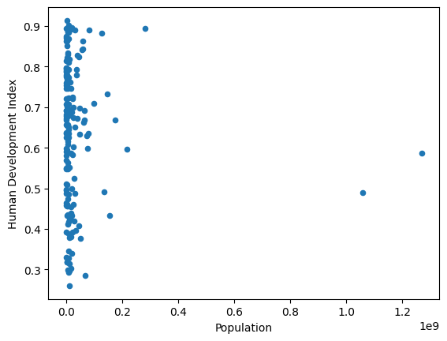
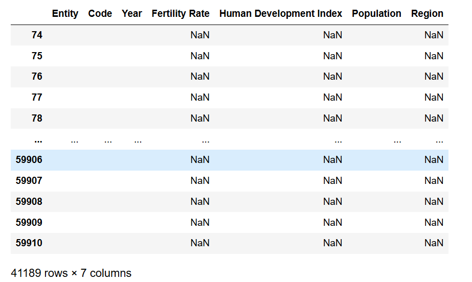

---
jupyter:
  jupytext:
    formats: ipynb,Rmd
    text_representation:
      extension: .Rmd
      format_name: rmarkdown
      format_version: '1.2'
      jupytext_version: 1.17.2
  kernelspec:
    display_name: Python 3 (ipykernel)
    language: python
    name: python3
---

# Filtering Data Frames with Boolean Series

<!---
📝 NOTE: from meeting with Matthew: Boolean series (and matching of row labels there) e.g. Boolean array will operate like iloc, Boolean Series will match row labels.

Add a separate page for Boolean indexing in a sensible place (build with numpy first first then show with Series) - show that order doesn't matter e.g. Booleans are matched by label not by position. Show this error:

```
import pandas as pd
df = pd.read_csv('birth_weights.csv')
df.head()
female_mf = df['sex'] == 2
female_mf.head()
df2 = df.sort_values('sex')
df2
df2[female_mf].describe()
df[female_mf].describe()
df.loc[female_mf]
df.iloc[female_mf]
```

Covered on this page:

* filtering (ex: df[df['age'] > 30])
* Boolean indexing, with Boolean series (and matching of row labels there); range indexing on labels (inclusive of last element)

Structure of this page:

* show Boolean arrays and boolean filtering of arrays

* build a Series, show Boolean series and filtering Series with Boolean arrays/series

* show Boolean filtering with DataFrames
-->

Once we have got our data into a Pandas Data Frame, no doubt we will want to filter and select specific portions of it for visualisation and analysis. 

On this page we will look at different methods of filtering. As on previous pages, we will focus on how Pandas is built from Numpy, and assess the similarities and differences in how filtering works on objects from both libraries.


## Pandas from Numpy, once more

To explore filtering, let's create some Numpy arrays, containing the [HDI data](https://ourworldindata.org/grapher/children-per-woman-vs-human-development-index):

```{python}
# Import libraries for this page
import numpy as np
import pandas as pd
```

We build the constituent arrays:

```{python}
# Standard three-letter code for each country
country_codes_array = np.array(['AUS', 'BRA', 'CAN',
                                'CHN', 'DEU', 'ESP',
                                'FRA', 'GBR', 'IND',
                                'ITA', 'JPN', 'KOR',
                                'MEX', 'RUS', 'USA'])
country_codes_array
```

```{python}
# Human Development Index Scores for each country
hdis_array = np.array([0.896, 0.668, 0.89,
                       0.586, 0.89,  0.828,
                       0.844, 0.863, 0.49,
                       0.842, 0.883, 0.824,
                       0.709, 0.733, 0.894])
hdis_array
```

Let's say we want to view HDI values that are bigger than the median HDI
value.

First, we can calculate the median, using the `np.median()` function:

```{python}
# Get the median HDI
np.median(hdis_array)
```

Next, we can create a *Boolean array* by using a comparison operator.

In this case `>` is the operator we want, with the `hdis_array` on the left hand side, and the median value of the array on the right hand side:

```{python}
# Create a Boolean array
hdis_array_grtr_median_bool =  hdis_array > np.median(hdis_array)
hdis_array_grtr_median_bool
```

The array in the output of the cell above is the same length as the
`hdis_array` and it contains `True` value where the element in `hdis_array` is
larger than the median HDI score (and `False` values otherwise).


Our Boolean array can now be used to retrieve elements of the `hdis_array` that are greater than the median HDI value. We just place our filter in between square brackets used to index the array. The `True` values act as "on switches" (keeping that element in the output array) and the `False` values act as "off switches" (removing that element from the output array):

```{python}
# Filter the `hdis_array`
hdis_array[hdis_array_grtr_median_bool]
```

If we're particularly neurotic, we can check using the [`all()`](https://docs.python.org/3/library/functions.html#all) function that this operation has, in fact, only returned elements greater than the median:

```{python}
# Check we have what we want
all(hdis_array[hdis_array_grtr_median_bool] > np.median(hdis_array))
```

Because Python treats `True` values as being equal to 1 and `False` values as being equal to 0, taking the mean of a Boolean array works out the same as calculating the proportion of `True` values. (*NB*: this is because when we do this operation, we are doing something like $\frac{1+1+1...+0+0}{n}$. The `False` (aka `0`) values add nothing to the numerator of the mean calculation, leaving only the `True` (aka `1`) values. This effectively gives us a count of the `True` values, divided by the total number of values, which returns the proportion of `True`'s.

Using `np.mean()` we can quickly count the proportion of `True` values, which as expected, because we are dealing with a median, is close to 0.5:

```{python}
# Count the proportion of `True` values
np.mean(hdis_array_grtr_median_bool)
```

This can be very useful when counting the proportion of participants or observations with a particular categorical feature (proportion of males/females, proportion of democratic countries etc).

We can also, if we wish, turn our Boolean array into a Boolean *Series* using the `pd.Series()` constructor.

This has the benefit of the Series `index`. In the present context, when we put the three-letter country codes as the `index`, we can keep track of the country that each filtered value corresponds to.

Let's create a Boolean Series:

```{python}
# Make a pandas Series
hdis_array_bool_series = pd.Series(hdis_array_grtr_median_bool, 
                                   index=country_codes_array)
hdis_array_bool_series
```

Even better, let's manually specify the `name` attribute - to make it clearer
down the line what the `True` and `False` values mean e.g. whether each
country has a higher-than-median HDI score:

```{python}
# Set the `name` attribute
hdis_array_bool_series.name = 'hdi_grtr_thn_median'

hdis_array_bool_series
```

This has advantages over the Numpy Boolean array in terms of interpretability (it's less easy to forget the meaning of what is in the `values` component of the Series!).

We also have access to all of the Pandas Series methods:

```{python}
# Max
hdis_array_bool_series.max()
```

```{python}
# Min
hdis_array_bool_series.min()
```

```{python}
# Mean (returns the proportion of `True` values)
hdis_array_bool_series.mean()
```

```{python}
# We can achieve the same result as the cell above using the `.sum()` method, then dividing by the `len()` of the Series
# the `.sum()` method adds up the `True` values, dividing by the `len()` of the Series divides by the number of observations
# in the Series, giving us the mean (in this case a proportion)
hdis_array_bool_series.sum()/len(hdis_array_bool_series)
```

We can use the Boolean Series to filter, exactly as we would with a Numpy array:

```{python}
# Same result when we filter with the Boolean series
hdis_array[hdis_array_bool_series]
```

However, we're not really getting the benefit of having an index, if we just use the Series to filter a Numpy array.

The real benefit comes from using Boolean Series to filter values in a Data Frame. We will look at this in the next section.


## Filtering in Pandas

You know by now that *Data Frames are a dictionary-like collection of Series*.

Because Series are built (in part) from Numpy arrays, filtering the Data Frame works very much like filtering with Boolean Numpy arrays and Pandas Series.

As with Series, the real advantage comes in having a shared index, as it keeps the filtering process highly interpretable and non-error prone.

To explore further, let's import the HDI data:

```{python}
# Import our dataset
df = pd.read_csv("data/year_2000_hdi_fert.csv")
# Set the index
df = df.set_index("Code")
df
```

Now, to view the median we can use the `.median()` Series method, rather than calling the `np.median()` function as we did earlier. (*NB*: we mentioned on a [previous page](0_2_pandas_dataframes_attributes_methods.Rmd) that Pandas Series *methods* are sometimes inherited from Numpy *functions*, but they generally give better efficiency and readability, as is the case here...):

```{python}
# Get the median HDI
df['Human Development Index'].median()
```

Because Data Frames force all their constituent Series (columns) to share an `index`, creating a Boolean Series has the desirable characteristic of associating a row label with each Booelan.

For instance, let's use direct indexing with a column name (`df['Human Development Index']`) to create a Boolean Series which is `True` where the country has a HDI score above the median HDI score: 

```{python}
# Create a Boolean Series
df['Human Development Index'] > df['Human Development Index'].median()
```

As mentioned above, this is more interpretable that a Numpy array just containing Booleans, with no `index`.

Again, to increase interpretabiity, we can assign this Boolean Series a new `name` attribute:

```{python}
# Create a Boolean Series by using a comparison operator on the DataFrame column
boolean_series_from_df = df['Human Development Index'] > df['Human Development Index'].median()

boolean_series_from_df.name = 'HDI_grtr_than_median'

boolean_series_from_df
```

We can now use our Boolean Series to filter the whole Data Frame. This let's use view entire rows, but only for rows corresponding to countries with greater than median HDI scores:

```{python}
# Filter the DataFrame using the Boolean Series we got from using a comparison operator on the DataFrame column
df[boolean_series_from_df]
```

This filtering operation was done via a Boolean Series which was created using direct indexing on the Data Frame itself (`df['Human Development Index']`).

Earlier, we "hand built" a Boolean Series from a Numpy array, another array for the index, and a manually specified `name` attribute. Here is that Series:

```{python}
# Our "handmade" Boolean Series
hdis_array_bool_series
```

This hand-built Series returns the same rows of the Data Frame as Series we got by using only Data Frame columns:

```{python}
# We can also filter with our "handmade" Series
df[hdis_array_bool_series]
```

We can use the Boolean Series to create a new Data Frame. This let's us use Pandas' statistical and plotting methods on subsets of the data.

For instance, we may want to look for differences between countries *above* the median HDI, and countries *below* the median HDI.

We can use our Boolean filter as follows:

```{python}
# Show countries with greater than median HDI
above_median_HDI = df[boolean_series_from_df]

above_median_HDI
```

We can "flip" the `True` and `False` values in the Boolean using the `~` operator (which we can read as "NOT").

So, here is our Boolean Series:

```{python}
# Show the Boolean Series
boolean_series_from_df
```

We can reverse each `True` to a `False` and vice versa by placing the `~` symbol in front of the Boolean Series, like this:

```{python}
# "Flip" the Boolean Series with the "~" operator
~boolean_series_from_df
```

Let's use this operation (with `~`) to make a new Data Frame containing only the countries scoring below the median HDI:

```{python}
# Use the `~` operator to show countries with BELOW median HDI
below_median_HDI = df[~boolean_series_from_df]

below_median_HDI 
```

Now, on each Data Frame, we can call the `.describe()` method separately, to inspect the differences:

```{python}
# Use the `.describe()` method with countries with above the median HDI
above_median_HDI['Fertility Rate'].describe()
```

```{python}
# Use the `.describe()` method with countries with below the median HDI
below_median_HDI['Fertility Rate'].describe()
```

::: {exercise-start}
:label: below-replacement
:class: dropdown
:::

For a country to be at "replacement rate" - e.g. the rate at which the population will remain constant, rather than increase or decrease - the `Fertility Rate` must be above [2.1](https://ourworldindata.org/data-insights/which-countries-have-fertility-rates-above-or-below-the-replacement-level). 

Your task is to use a Boolean Series to calculate the proportion of countries in `df` which are below the 2.1 replacement rate.

Try to do this in as few lines as code as possible, using Pandas methods rather than functions from other libraries...

```{python}
# Your code here
```

::: {exercise-end}
:::

::: {solution-start} below-replacement
:class: dropdown
:::

There are several ways to approach this, here are two.

First, for both methods we generate a Boolean Series using `df['Fertility Rate'] < 2.1` - this will be `True` where the `Fertility Rate` is *under* 2.1, and `False` otherwise.

In the first solution, we take the `sum()` of the `True` values, then divide that by the `len()` of the Dataframe (i.e. by the number of observations):

```{python}
# Solution 1
below_replacement_bool_series = df['Fertility Rate'] < 2.1

below_replacement_bool_series.sum()/len(df)
```

The second solution is more efficient, as the `.mean()` method will perform the same calculation with less typing.

```{python}
# Solution 2
below_replacement_bool_series.mean()
```

Strikingly, 80% of the countries in the Dataframe are below the replacement rate...


::: {solution-end}
:::


## Cleaning, summarizing and plotting data with Boolean Indexing

Remember, the data we have looked at on this page so far is just a fraction of the countries in the full HDI dataset. Let's import the full dataset, so we can use Boolean filtering to graphically inspect trends for countries above and below the median HDI. We will look at the data from all of the countries, but just for the year 2000, to keep the plot interpretable. 

We'll also use multiple methods from the [Pandas methods](0_2_pandas_dataframes_attributes_methods.Rmd) page, to get the full data ready to generate these plots.

First, let's import the data:

```{python}
# Import the full dataset
full_df = pd.read_csv('data/children-per-woman-vs-human-development-index.csv')

full_df
```

This data is in *long format* - each row is an observation of one country, but each country appears in multiple rows. E.g. there are repeated observations from the same countries. If you look at the last few rows, you'll see repeated observations on Zimbabwe, over multiple years.

You'll also notice (an unfortunate commonality of many datasets) that the full data contains many NaN values (we'll deal with some of these shortly).

As mentioned above, we will look at data from the year 2000, but using the full complement of countries. This will keep the plots interpretable. 

We can use Boolean filtering to strip the Data Frame down to just observations from the year 2000:

```{python}
# Filter out all years apart from the year 2000
full_df_2000 = full_df[full_df['Year'] == 2000]

full_df_2000
```

You can see that after this operation, the index labels (numbers from th default `RangeIndex`) no longer line up from 0 to the maximum value.

Let's make a more usable index, but setting the `index` to be the three-letter country codes in the `Code` column:

```{python}
# Set the index
full_df_2000.index = full_df_2000['Code']

full_df_2000
```

You might notice that now we have `NaN` values in the index. We don't want this, so let's remove those observations.

We can again do this via Boolean filtering:

*NB:* the `~` operator, we are asking for rows with index labels that are NOT NaN...

```{python}
# Remove NaN data 
full_df_2000 = full_df_2000[~full_df_2000['Code'].isna()]

full_df_2000
```

Let's inspect the index, to see what countries are left after removing the NaN values:

```{python}
# Inspect the index
list(full_df_2000.index)
```

If you scroll down this list, you can see that we have some rows that *maybe* do not correspond to countries (`OWID_WRL`, `OWID_KOS`, `OWID_SRM`).

Let's inspect these rows:

```{python}
# Inspect rows with non-standard codes
full_df_2000.loc[['OWID_WRL', 'OWID_KOS', 'OWID_SRM']]
```

Ok, so we probably want to keep `Kosovo` and `Serbia and Montenegro`, but will drop the row with the data for the whole world.

We can use the `.drop()` method, with the `labels=` argument to tell Pandas to drop the row with the `'OWID_WRL'` label:

```{python}
# Remove junk rows with the `.drop()` method
full_df_2000 = full_df_2000.drop(labels=['OWID_WRL'])

full_df_2000
```

We now have a clean Data Frame. Let's plot HDI against fertility rate, to graphically inspect the trend:

```{python}
# Plot the data
full_df_2000.plot(x='Human Development Index',
                  y='Fertility Rate',
                  kind='scatter')
```

To plot the trend either side of the HDI median, let's create a Boolean Series based on the median HDI value.

This Series is `True` where the country has a greater than median HDI score, and `False` otherwise:

```{python}
# Make a Boolean Series based on the median HDI
full_df_2000_gtr_than_median_HDI_bool = full_df_2000['Human Development Index'] > full_df_2000['Human Development Index'].median()

full_df_2000_gtr_than_median_HDI_bool
```

We can use this filter, and the `.plot()` method, to inspect the trend either side of the median HDI - (again, to get the values from the *opposite* side of the median, we can use the `~` operator):

```{python}
# Plot countries with above median HDI
full_df_2000[full_df_2000_gtr_than_median_HDI_bool].plot(x='Human Development Index',
                                                          y='Fertility Rate',
                                                          kind='scatter');
```

```{python}
# Plot countries with below median HDI
full_df_2000[~full_df_2000_gtr_than_median_HDI_bool].plot(x='Human Development Index',
                                                          y='Fertility Rate',
                                                          kind='scatter');
```

We can see graphically that the trends differ either side of the median, in a way that is clearer than looking at the full data on one plot. 

We can also use the same filtering procedure to view statistics on the subsets of countries either side of the median HDI:

```{python}
# Getting `.describe()` stats for `Fertility Rate` from countries above the median HDI
full_df_2000[full_df_2000_gtr_than_median_HDI_bool]['Fertility Rate'].describe()
```

```{python}
# Getting `.describe()` stats for `Fertility Rate` from countries below the median HDI (again, note the `~` operator)
full_df_2000[~full_df_2000_gtr_than_median_HDI_bool]['Fertility Rate'].describe()
```

::: {exercise-start}
:label: a-big-pop
:class: dropdown
:::

Let's say we are interested in whether `Population` is associated with `Human Development Index`. We might inspect a scatter plot of the two variables, to visually inspect for a trend. However, there may be a problem:




The countries with huge populations are outliers which extend the x-axis far to the right, whilst most countries remain compressed near the far left of the x-axis. The pattern looks consistent with a random association, but perhaps there is a trend that is hard to see, in the presence of these extreme outliers?

Your task is to use Boolean filtering to "trim" out observations *above* the [25% percentile](https://en.wikipedia.org/wiki/Percentile) of the `Population` scores. You should then create a scatter plot with `Population` on the x-axis, and `Human Development Index` on the y-axis, from the trimmed data. This will allow you to inspect the trend of the cluster of countries with smaller populations.

You should try to do this in one or two lines of code, and using Pandas methods only.

```{python}
# Your code here
```

::: {exercise-end}
:::

::: {solution-start} a-big-pop
:class: dropdown
:::

Our solution - to make it easier to read - creates this plot in two lines of code (though it is possible to do it one line, using method chaining). 

First, we use the "less than" (`<`) comparison operator to create a Boolean Series. This Series is `True` where the corresponding row in `full_df_2000` has a smaller-than-the-25th-percentile value, and `False` otherwise.

To calculate the value of the 25th percentile, we use `.describe()`. Astute readers may have noticed that `.describe()` reports the quartiles (25%, 50%, 75% percentiles) of numeric variables. Because `.describe()` returns a Dataframe, we can use `.loc` indexing with the string `25%` to retrieve the value of the 25th percentile (the string `25%` is the `index` label of the 25th percentile, in the `.describe()` Dataframe output). Another option here would be to use `df['Fertility Rate'].quantile(0.25)` to get the 25th percentile - there are always many roads to the same outcome in Pandas...

A second line of code then uses the `.plot()` method, with appropriate `x`, `y` and `kind` arguments, to generate the plot:

```{python}
# Create a Boolean Series to filter the data
below_25_filter = full_df_2000['Population'] < full_df_2000['Population'].describe().loc["25%"]

# filter the data and plot
full_df_2000[below_25_filter].plot(x='Population',
                                   y='Human Development Index',
                                   kind="scatter");
```

Interesting, it looks like actually, there may be a negative linear trend in these countries, which was not visible in the scatterplot showing all of the data.

::: {solution-end}
:::


::: {exercise-start}
:label: NaNs-army
:class: dropdown
:::

For this exercise, we want you to make the stuff of a data analyst's nightmares: the result of a filtering operation which contains only NaN values, and whitespace elsewhere. 

Do you remember the `full_df` Dataframe, from before we filtered it down to just rows corresponding to the year 2000?. Here it is:

```{python}
# Show the full Dataframe
full_df
```

This data contains many NaN values. Your task is to use Boolean filtering on this Dataframe, to return a Dataframe that contains:

* *only rows where `Fertility Rate` has NaN values...*

* ...and contains blank space (`''`) for all other values *that are not NaN* (this should apply across all of the columns). 

The end product should look like this (and have the same dimensionality as the pictured Dataframe):



You can do this in one line of code.

```{python}
# Your code here
```

::: {exercise-end}
:::

::: {solution-start} NaNs-army
:class: dropdown
:::

Remember the `.isna()` method shown above? This creates a Boolean Series containing `True` values where data is NaN, and `False` values for non-NaN data. As such, you can get the "NaNs and blanks" Dataframe shown above by running the code in the cell below.

First, we filter the Dataframe to contain only rows where `Fertility Rate` is NaN. Then we use `.isna()` method to make the data across the whole Dataframe `True` where there are NaN values and `False` otherwise. We then use the `.replace()` method to replace `False` values with blankspace (`''`) and the `True` values with `np.nan`.

```{python}
# Solution 1
full_df[full_df['Fertility Rate'].isna()].isna().replace(False, '').replace(True, np.nan)
```

You could also use the Pandas *function* `pd.isna()` here, to get the same result...

```{python}
# Solution 2
pd.isna(full_df[pd.isna(full_df['Fertility Rate'])]).replace(False, '').replace(True, np.nan)
```

Note the `FutureWarning:`, this means this solution will not be possible in future versions of Pandas...

We sincerely hope you never have to see another Dataframe like this one.


::: {solution-end}
:::


## Summary

This page has looked at the similarities/differences in filtering data with collections of Booleans in Numpy and Pandas.
